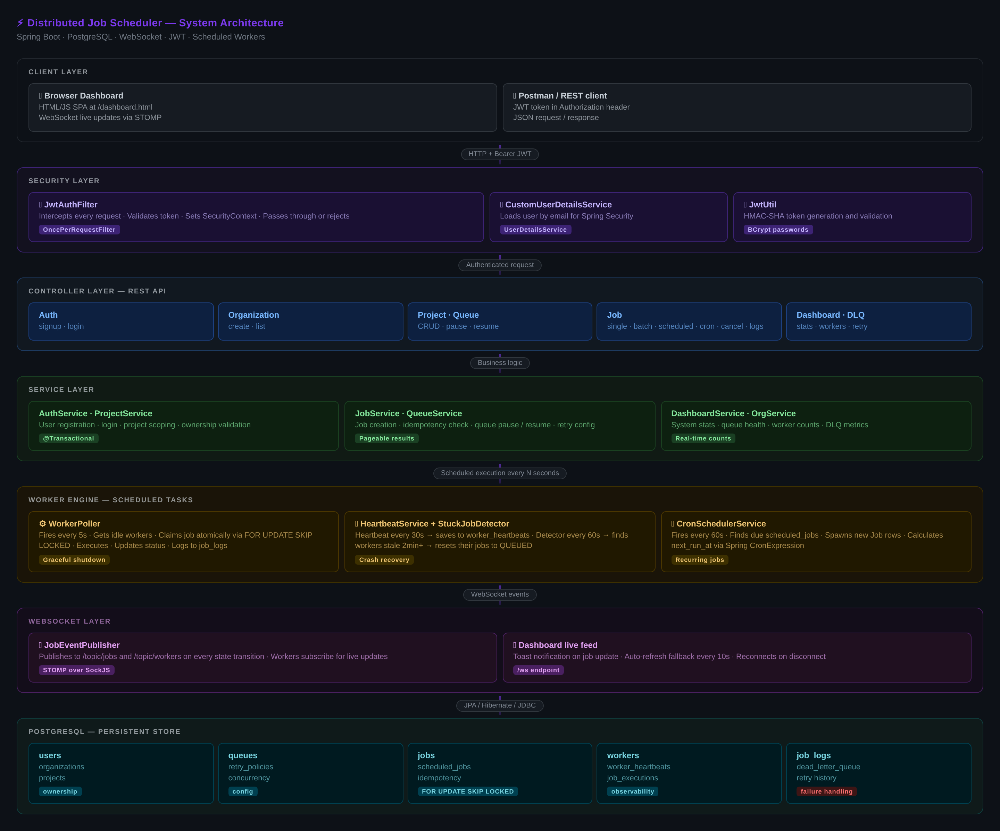
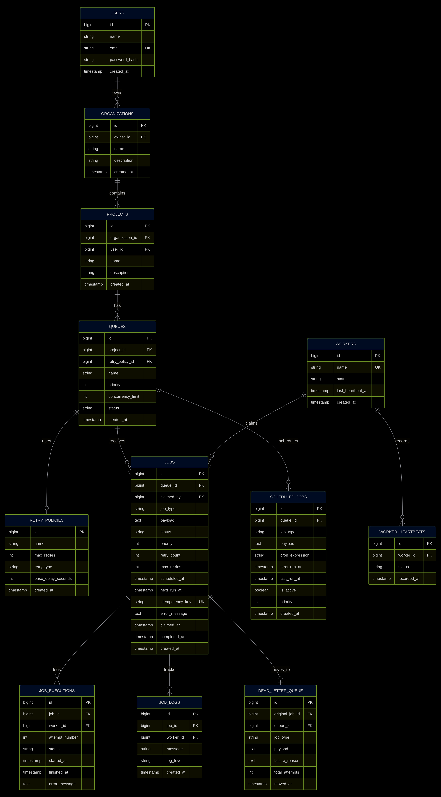
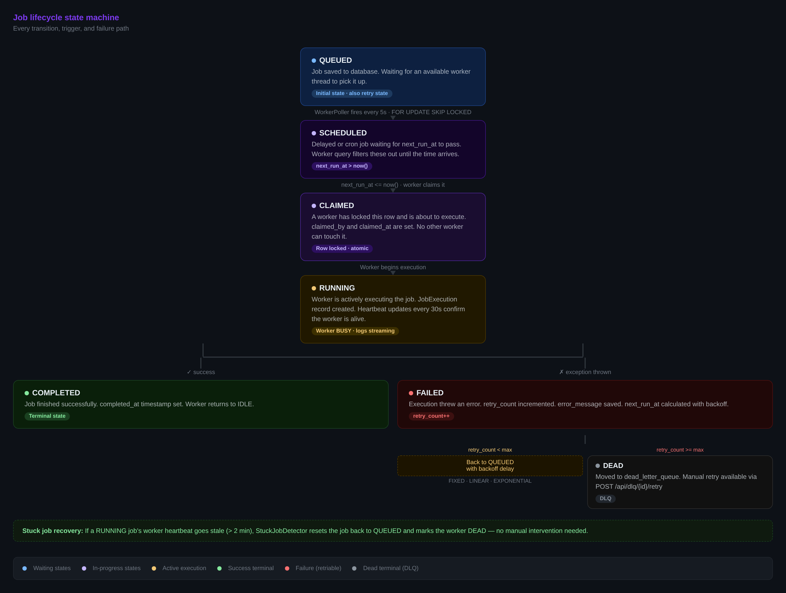

# Distributed Job Scheduler

A production-style distributed job scheduling system built with Java Spring Boot and PostgreSQL. Supports background job execution, cron-based recurring jobs, real-time monitoring, retry logic with configurable backoff, dead letter queue, and live WebSocket updates.

---

## System Architecture



The system is built in clean layers:

- **Client layer** — a browser dashboard and REST API clients communicate over HTTP with JWT tokens
- **Security layer** — every request passes through `JwtAuthFilter` before reaching any controller
- **Controller layer** — thin REST endpoints delegate immediately to services
- **Service layer** — all business logic, no database access in controllers
- **Worker engine** — scheduled tasks run on a thread pool: polling, heartbeating, stuck-job recovery, and cron scheduling
- **WebSocket layer** — `JobEventPublisher` broadcasts job and worker state changes in real time
- **PostgreSQL** — single source of truth for all state, using row-level locking for atomic job claiming

---

## Database Design



### Schema overview

| Table | Purpose |
|---|---|
| `users` | Authentication — email + bcrypt password |
| `organizations` | Top-level grouping, owned by a user |
| `projects` | Belongs to an organization, groups queues |
| `queues` | Named channel — priority, concurrency limit, retry policy |
| `retry_policies` | Reusable retry config — FIXED / LINEAR / EXPONENTIAL |
| `jobs` | Core unit of work — status, payload, scheduling, idempotency |
| `scheduled_jobs` | Cron job templates — spawns job instances on schedule |
| `workers` | Registered worker threads — status and last heartbeat |
| `worker_heartbeats` | Heartbeat history — one record per 30s per worker |
| `job_executions` | One record per attempt — started/finished/error |
| `job_logs` | Append-only log lines per job — INFO / WARN / ERROR |
| `dead_letter_queue` | Permanently failed jobs — available for manual retry |

### Key design choices

- `jobs.idempotency_key` — unique constraint prevents duplicate job creation
- `jobs.next_run_at` — controls when retried or delayed jobs become claimable
- `jobs.claimed_by` — FK to workers, null until claimed
- `retry_policies` separate table — reusable across queues, not duplicated inline

---

## Job Lifecycle



```
QUEUED → SCHEDULED → CLAIMED → RUNNING → COMPLETED
                                       ↘ FAILED → (retry with backoff) → QUEUED
                                                → (max retries hit) → DEAD → DLQ
```

Stuck job recovery: if a RUNNING job's worker goes silent for 2+ minutes, the StuckJobDetector resets the job to QUEUED and marks the worker DEAD automatically.

---

## Tech Stack

| Technology | Version | Purpose |
|---|---|---|
| Java | 21 | Language |
| Spring Boot | 4.x | Framework |
| Spring Security | 7.x | Auth and endpoint protection |
| Spring Data JPA | 4.x | ORM and repository layer |
| PostgreSQL | 14+ | Database + row-level locking |
| JJWT | 0.12.3 | JWT token generation and validation |
| Springdoc OpenAPI | 2.8.9 | Auto-generated Swagger docs |
| Spring WebSocket | 4.x | STOMP over SockJS live updates |
| Lombok | 1.18.x | Boilerplate reduction |
| JUnit 5 + Mockito | latest | Unit and integration tests |

---

## Setup

### Prerequisites
- Java 21+
- PostgreSQL 14+
- Maven 3.8+

### 1. Create database
```sql
CREATE DATABASE job_scheduler;
```

### 2. Configure
Edit `src/main/resources/application.properties`:
```properties
spring.datasource.url=jdbc:postgresql://localhost:5432/job_scheduler
spring.datasource.username=your_username
spring.datasource.password=your_password
jwt.secret=your-secret-key-at-least-32-characters-long
jwt.expiration=86400000
```

### 3. Run
```bash
./mvnw spring-boot:run
```

### 4. Access
| URL | Description |
|---|---|
| `http://localhost:8080/dashboard.html` | Live monitoring dashboard |
| `http://localhost:8080/swagger-ui/index.html` | Interactive API docs |
| `http://localhost:8080/api` | REST API base |

---

## API Reference

### Auth
| Method | Endpoint | Auth | Description |
|---|---|---|---|
| POST | `/api/auth/signup` | No | Register user |
| POST | `/api/auth/login` | No | Login, get JWT |

### Organizations
| Method | Endpoint | Auth | Description |
|---|---|---|---|
| POST | `/api/organizations` | Yes | Create organization |
| GET | `/api/organizations` | Yes | List my organizations |

### Projects
| Method | Endpoint | Auth | Description |
|---|---|---|---|
| POST | `/api/projects` | Yes | Create project |
| GET | `/api/projects` | Yes | List my projects |
| GET | `/api/projects/{id}` | Yes | Get project |
| PUT | `/api/projects/{id}` | Yes | Update project |
| DELETE | `/api/projects/{id}` | Yes | Delete project |

### Retry Policies
| Method | Endpoint | Auth | Description |
|---|---|---|---|
| POST | `/api/retry-policies` | Yes | Create retry policy |
| GET | `/api/retry-policies` | Yes | List all policies |

### Queues
| Method | Endpoint | Auth | Description |
|---|---|---|---|
| POST | `/api/projects/{id}/queues` | Yes | Create queue |
| GET | `/api/projects/{id}/queues` | Yes | List queues |
| PUT | `/api/projects/{id}/queues/{qId}/pause` | Yes | Pause queue |
| PUT | `/api/projects/{id}/queues/{qId}/resume` | Yes | Resume queue |
| DELETE | `/api/projects/{id}/queues/{qId}` | Yes | Delete queue |

### Jobs
| Method | Endpoint | Auth | Description |
|---|---|---|---|
| POST | `/api/jobs` | Yes | Submit single job |
| POST | `/api/jobs/batch` | Yes | Submit multiple jobs |
| POST | `/api/jobs/scheduled` | Yes | Create recurring cron job |
| GET | `/api/jobs/scheduled` | Yes | List cron schedules |
| PUT | `/api/jobs/scheduled/{id}/deactivate` | Yes | Deactivate cron job |
| GET | `/api/jobs/{id}` | Yes | Get job status |
| GET | `/api/jobs/{id}/logs` | Yes | Get job execution logs |
| GET | `/api/jobs/queue/{queueId}?page=0&size=20` | Yes | Jobs by queue (paginated) |
| GET | `/api/jobs/status/{status}?page=0&size=20` | Yes | Filter by status (paginated) |
| PUT | `/api/jobs/{id}/cancel` | Yes | Cancel queued job |

### Monitoring
| Method | Endpoint | Auth | Description |
|---|---|---|---|
| GET | `/api/dashboard` | Yes | System-wide stats |
| GET | `/api/workers` | Yes | Worker status |
| GET | `/api/workers/{id}/jobs` | Yes | Jobs by worker |
| GET | `/api/dlq` | Yes | Dead letter queue |
| POST | `/api/dlq/{id}/retry` | Yes | Re-queue failed job |

---

## Concurrency — How Atomic Claiming Works

The critical question: if two workers poll simultaneously, how do we guarantee only one claims a given job?

```sql
SELECT j.* FROM jobs j
JOIN queues q ON j.queue_id = q.id
WHERE j.status = 'QUEUED'
AND q.status = 'ACTIVE'
AND j.next_run_at <= NOW()
AND (
    SELECT COUNT(*) FROM jobs running
    WHERE running.queue_id = j.queue_id
    AND running.status = 'RUNNING'
) < q.concurrency_limit
ORDER BY q.priority DESC, j.priority DESC, j.created_at ASC
FOR UPDATE OF j SKIP LOCKED
LIMIT 1
```

- `FOR UPDATE` — exclusive row lock. No other transaction can touch this row.
- `SKIP LOCKED` — instead of waiting, other workers skip locked rows and grab the next available one.
- `LIMIT 1` — one job per worker per poll cycle.
- Wrapped in `@Transactional` — the lock holds until status is updated to RUNNING.

Result: zero duplicate execution, even with many concurrent workers.

---

## Retry Strategies

| Strategy | Formula | Example (base = 30s) |
|---|---|---|
| FIXED | base | 30s → 30s → 30s |
| LINEAR | base × attempt | 30s → 60s → 90s |
| EXPONENTIAL | base × 2^(attempt−1) | 30s → 60s → 120s → 240s |

Retry policies are stored in the `retry_policies` table and linked to queues, so you can define a policy once and reuse it across multiple queues.

---

## Failure Scenarios Handled

| Scenario | Solution |
|---|---|
| Two workers claim the same job | `FOR UPDATE SKIP LOCKED` — impossible by design |
| Worker crashes mid-execution | `StuckJobDetector` resets job to QUEUED after 2min stale heartbeat |
| Job fails repeatedly | Retry with backoff → DLQ after max retries |
| Duplicate job submission | `idempotency_key` unique constraint returns existing job |
| Queue overloaded | `concurrency_limit` caps parallel execution |
| Queue paused | Worker query filters out PAUSED queues |
| App restart during execution | `@PreDestroy` graceful shutdown waits for in-flight jobs |

---

## WebSocket Live Updates

The dashboard connects via STOMP over SockJS at `/ws`. Workers publish events to:
- `/topic/jobs` — on every job state transition
- `/topic/workers` — on every worker status change

The dashboard subscribes to both topics and shows toast notifications in real time, with a 10-second polling fallback.

---

## Running Tests

```bash
./mvnw test
```

Test coverage includes:
- `JobServiceUnitTest` — Mockito unit tests: job creation, idempotency, paused queue rejection, cancel running job
- `WorkerServiceUnitTest` — Mockito unit tests: shutdown flag, no jobs available, DLQ logic, backoff calculations
- `JobServiceTest` — Spring integration tests: full context, real DB
- `WorkerServiceTest` — Spring integration tests: atomic claiming, future job skip

---

## Project Structure

```
src/main/java/com/placements/job_scheduler/
├── config/          SecurityConfig, SchedulerConfig, WebSocketConfig
├── controller/      REST endpoints — thin, no business logic
├── dto/             Request and response objects
│   ├── request/     CreateJobRequest, CreateQueueRequest, ...
│   └── response/    JobResponse, DashboardResponse, ...
├── entity/          JPA entities — one per database table
├── enums/           JobStatus, QueueStatus, WorkerStatus, RetryType
├── exception/       GlobalExceptionHandler, ResourceNotFoundException
├── repository/      Spring Data JPA repositories
├── security/        JwtAuthFilter, JwtUtil, CustomUserDetailsService
└── service/         All business logic
    ├── WorkerService.java        — polling, claiming, executing
    ├── HeartbeatService.java     — heartbeat + stuck job recovery
    ├── CronSchedulerService.java — recurring job spawning
    └── JobEventPublisher.java    — WebSocket event broadcasting

src/main/resources/
├── application.properties
└── static/
    └── dashboard.html            — single-page monitoring dashboard

src/test/
└── java/.../service/
    ├── JobServiceTest.java       — integration tests
    ├── WorkerServiceTest.java    — integration tests
    ├── JobServiceUnitTest.java   — Mockito unit tests
    └── WorkerServiceUnitTest.java — Mockito unit tests
```

