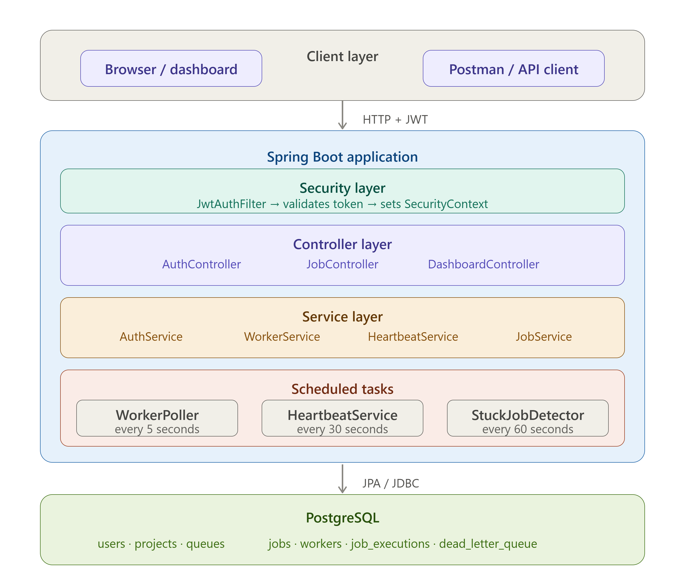
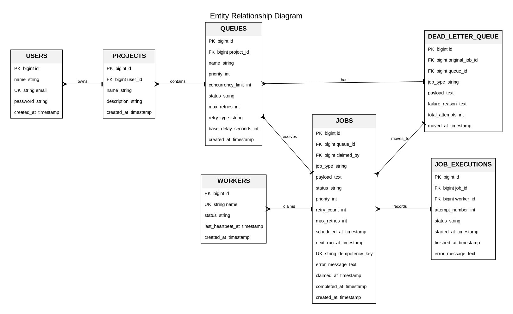
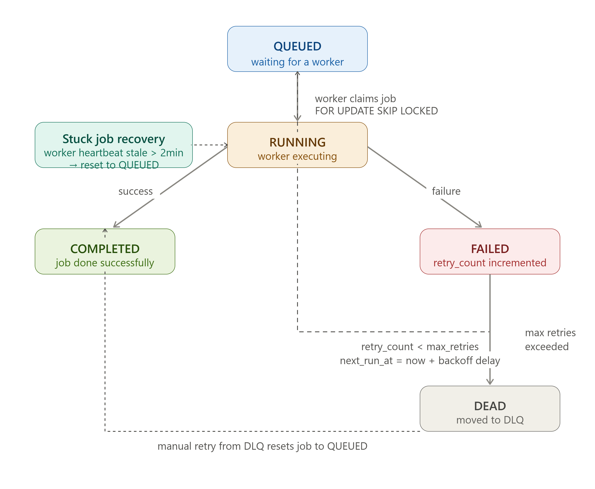

# Distributed Job Scheduler

A production-style distributed job scheduling system built with Java Spring Boot and PostgreSQL.

---

## What it does

This system lets users create projects, define queues with configurable retry policies, submit background jobs, and monitor everything through a real-time dashboard.

The core engineering challenge: **how do multiple workers process jobs concurrently without executing the same job twice?**

Solution: PostgreSQL's `FOR UPDATE SKIP LOCKED` — one atomic SQL statement that guarantees exactly-once job claiming across any number of concurrent workers.

---

## System Architecture



**Layers:**
- **Client layer** — Browser dashboard and API clients (Postman)
- **Security layer** — JWT filter validates every request before it reaches controllers
- **Controller layer** — Thin REST endpoints, no business logic
- **Service layer** — All business logic lives here
- **Scheduled tasks** — WorkerPoller (5s), HeartbeatService (30s), StuckJobDetector (60s)
- **PostgreSQL** — Single source of truth for all job state

---

## Database Design



**Key relationships:**
- A `User` owns many `Projects`
- A `Project` has many `Queues` (each with its own retry policy and concurrency limit)
- A `Queue` receives many `Jobs`
- A `Worker` claims and executes `Jobs`
- Every execution attempt is recorded in `JobExecutions`
- Permanently failed jobs move to `DeadLetterQueue`

---

## Job Lifecycle



| Status | Meaning |
|---|---|
| QUEUED | Waiting for an available worker |
| RUNNING | Claimed and being executed by a worker |
| COMPLETED | Finished successfully |
| FAILED | Execution failed, scheduled for retry |
| DEAD | Max retries exceeded, moved to DLQ |

---

## Tech Stack

| Technology | Purpose |
|---|---|
| Java 21 + Spring Boot 4.x | Core framework |
| PostgreSQL | Primary store + row-level locking |
| Spring Security + JWT | Auth and endpoint protection |
| Spring Data JPA + Hibernate | ORM and DB access |
| Springdoc OpenAPI | Auto-generated Swagger docs |
| Lombok | Boilerplate reduction |

---

## Setup

### Prerequisites
- Java 21+
- PostgreSQL 14+
- Maven 3.8+

### 1. Create database
```sql
CREATE DATABASE job_scheduler;
```

### 2. Configure application
Edit `src/main/resources/application.properties`:
```properties
spring.datasource.url=jdbc:postgresql://localhost:5432/job_scheduler
spring.datasource.username=your_username
spring.datasource.password=your_password
jwt.secret=your-secret-key-minimum-32-characters-long
```

### 3. Run
```bash
./mvnw spring-boot:run
```

### 4. Access
| URL | Description |
|---|---|
| `http://localhost:8080/dashboard.html` | Live monitoring dashboard |
| `http://localhost:8080/swagger-ui/index.html` | Interactive API docs |
| `http://localhost:8080/api` | REST API base URL |

---

## API Reference

### Auth
| Method | Endpoint | Auth | Description |
|---|---|---|---|
| POST | `/api/auth/signup` | No | Register new user |
| POST | `/api/auth/login` | No | Login, get JWT token |

### Projects
| Method | Endpoint | Auth | Description |
|---|---|---|---|
| POST | `/api/projects` | Yes | Create project |
| GET | `/api/projects` | Yes | List my projects |
| GET | `/api/projects/{id}` | Yes | Get project |
| PUT | `/api/projects/{id}` | Yes | Update project |
| DELETE | `/api/projects/{id}` | Yes | Delete project |

### Queues
| Method | Endpoint | Auth | Description |
|---|---|---|---|
| POST | `/api/projects/{id}/queues` | Yes | Create queue |
| GET | `/api/projects/{id}/queues` | Yes | List queues |
| PUT | `/api/projects/{id}/queues/{qId}/pause` | Yes | Pause queue |
| PUT | `/api/projects/{id}/queues/{qId}/resume` | Yes | Resume queue |
| DELETE | `/api/projects/{id}/queues/{qId}` | Yes | Delete queue |

### Jobs
| Method | Endpoint | Auth | Description |
|---|---|---|---|
| POST | `/api/jobs` | Yes | Submit job |
| GET | `/api/jobs/{id}` | Yes | Get job status |
| GET | `/api/jobs/queue/{queueId}` | Yes | Jobs by queue |
| GET | `/api/jobs/status/{status}` | Yes | Filter by status |
| PUT | `/api/jobs/{id}/cancel` | Yes | Cancel queued job |

### Monitoring
| Method | Endpoint | Auth | Description |
|---|---|---|---|
| GET | `/api/dashboard` | Yes | System-wide stats |
| GET | `/api/workers` | Yes | Worker status |
| GET | `/api/dlq` | Yes | Dead letter queue |
| POST | `/api/dlq/{id}/retry` | Yes | Re-queue failed job |

---

## Concurrency Design

The critical section is job claiming. The solution is one SQL statement:

```sql
SELECT j.* FROM jobs j
JOIN queues q ON j.queue_id = q.id
WHERE j.status = 'QUEUED'
AND q.status = 'ACTIVE'
AND j.next_run_at <= NOW()
AND (
    SELECT COUNT(*) FROM jobs running
    WHERE running.queue_id = j.queue_id
    AND running.status = 'RUNNING'
) < q.concurrency_limit
ORDER BY q.priority DESC, j.priority DESC, j.created_at ASC
FOR UPDATE OF j SKIP LOCKED
LIMIT 1
```

- `FOR UPDATE` locks the row exclusively
- `SKIP LOCKED` makes other workers skip locked rows instead of waiting
- `LIMIT 1` ensures each worker claims exactly one job per poll
- Wrapped in `@Transactional` so the lock holds until status is updated to RUNNING

---

## Retry Strategies

| Strategy | Formula | Example (base = 30s) |
|---|---|---|
| FIXED | base | 30s → 30s → 30s |
| LINEAR | base × attempt | 30s → 60s → 90s |
| EXPONENTIAL | base × 2^(attempt−1) | 30s → 60s → 120s |

---

## Failure Scenarios

| Scenario | How it's handled |
|---|---|
| Two workers claim same job | `FOR UPDATE SKIP LOCKED` — impossible by design |
| Worker crashes mid-execution | Heartbeat stale after 2 min → job reset to QUEUED |
| Job fails repeatedly | Retry with backoff → DLQ after max_retries |
| Duplicate job submission | `idempotency_key` unique constraint rejects duplicates |
| Queue overloaded | `concurrency_limit` caps parallel execution |
| Queue paused | Worker query filters out PAUSED queues |

---

## Project Structure